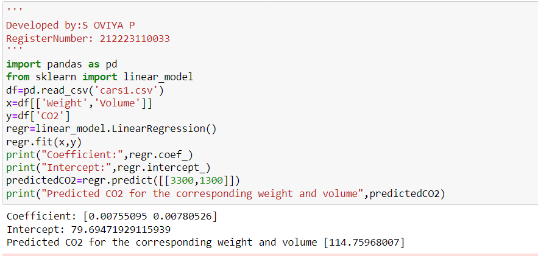

# Implementation of Multivariate Linear Regression
## Aim
To write a python program to implement multivariate linear regression and predict the output.
## Equipment’s required:
1.	Hardware – PCs
2.	Anaconda – Python 3.7 Installation / Moodle-Code Runner
## Algorithm:
### Step1

import pandas.

### Step2

import linear model from sklearn.
### Step3

read the files cars.csv

### Step4
Assign the values for x and y as required.

### Step5
create the linearregression model and predict the output

## Program:
```
Developed by:S OVIYA P
RegisterNumber: 212223110033
import pandas as pd
from sklearn import linear_model
df=pd.read_csv('cars.csv')
x=df[['Weight','Volume']]
y=df['CO2']
regr=linear_model.LinearRegression()
regr.fit(x,y)
print("Coefficient:",regr.coef_)
print("Intercept:",regr.intercept_)
predictedCO2=regr.predict([[3300,1300]])
print("Predicted CO2 for the corresponding weight and volume",predictedCO2)

```
## Output:


## Result
Thus the multivariate linear regression is implemented and predicted the output using python program.
